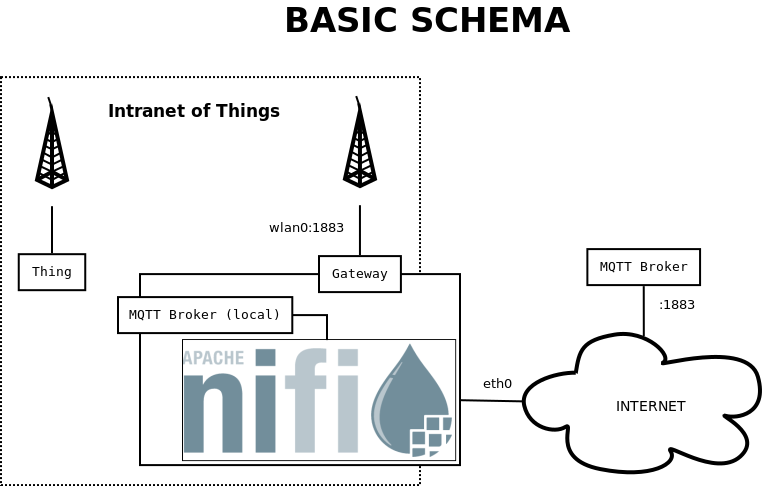
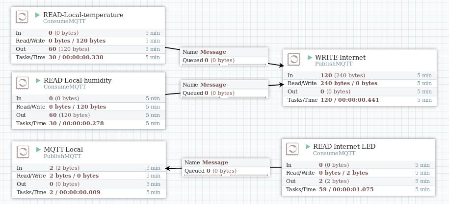
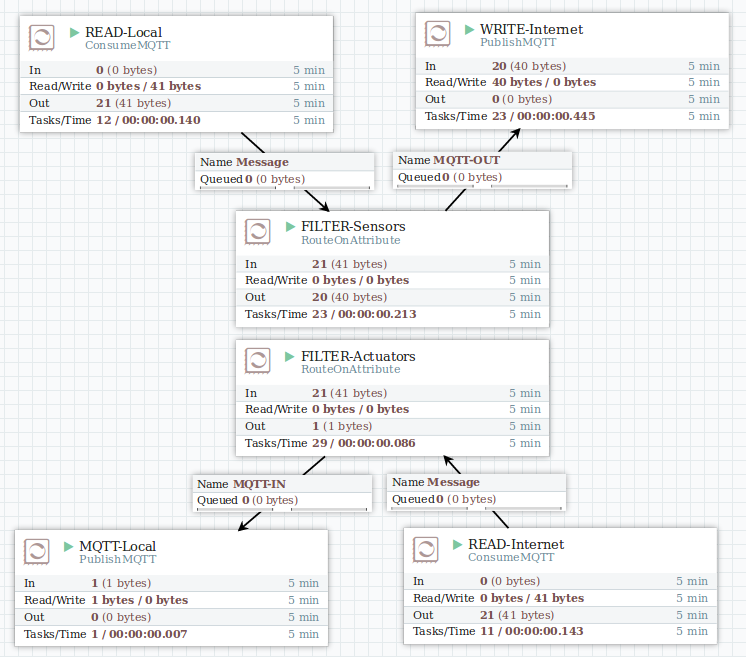
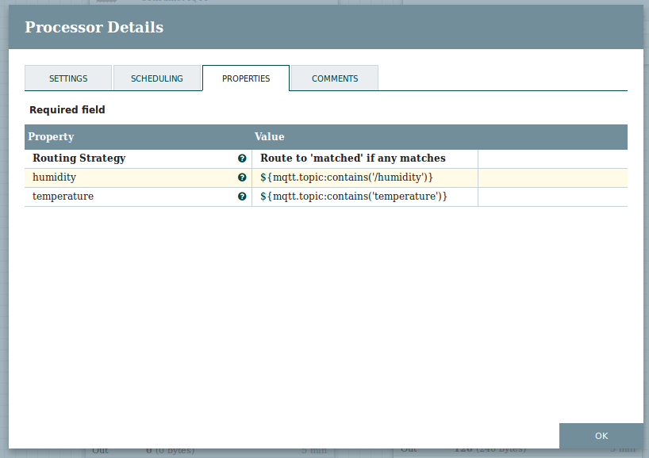
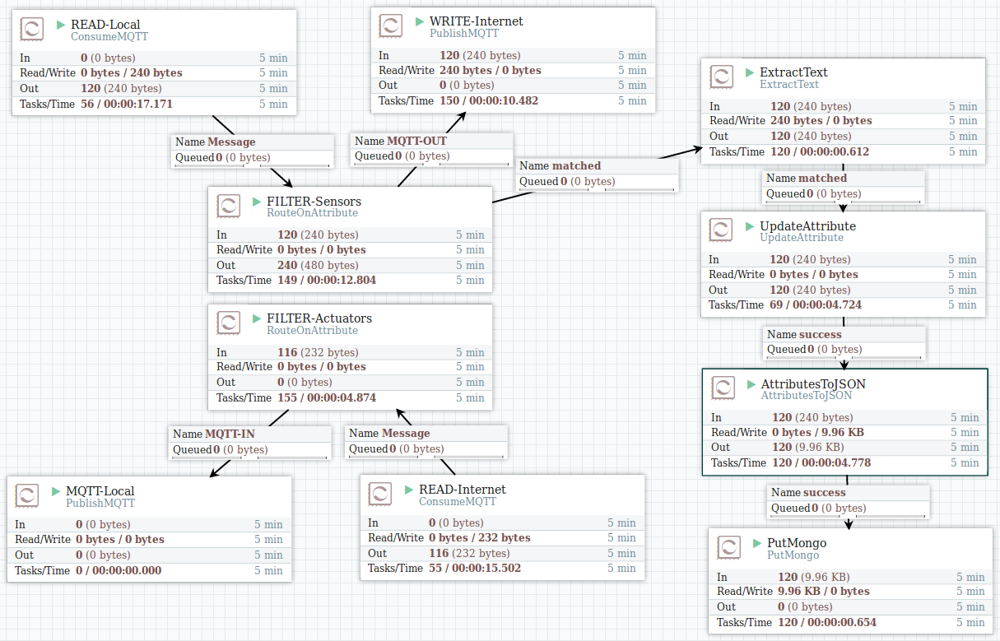

# Custom IoT gateway (Apache NiFi)


## Table of contents
* [Introduction](#introduction)
* [Installation](#installation)
	* [Optimization](#optimization)
* [Experiment](#experiment)
	* [Set up & changes](#setup)
	* [MQTT Bridging](#mqtt_bridging)
		* [Topic based](#mqtt_topic)
		* [Filter based](#mqtt_filter)
	* [MongoDB Storage](#store)
* [Troubleshooting](#troubleshooting)
* [Conclusion](#conclusion)
* [Future steps](#future)


## Introduction  <a name="introduction"></a>
In this PoC I will try to test the viability of [Apache NiFi](https://nifi.apache.org/) as a a tool to perform fog computing on an IoT gateway device.

The starting point is the "[custom gateway project](https://github.com/beeva-samuelmunoz/iot-gateway-custom)". A Raspberry Pi configured to act as a gateway.


### Installation  <a name="installation"></a>
How to install Apache NiFi in the gateway.

Taken from:
* [Getting Started with Apache NiFi](https://nifi.apache.org/docs/nifi-docs/html/getting-started.html)
* [NiFi System Administrator’s Guide](https://nifi.apache.org/docs/nifi-docs/html/administration-guide.html#how-to-install-and-start-nifi)

```bash
# Requirements
apt-get install oracle-java8-jdk

# Download the binary and decompress
wget http://apache.rediris.es/nifi/1.1.2/nifi-1.1.2-bin.tar.gz
tar -xzvf nifi-1.1.2-bin.tar.gz
rm nifi-1.1.2-bin.tar.gz
sudo mv nifi-1.1.2 /opt

# Create a user to execute the program
useradd -m -d /opt/nifi-1.1.2/ nifi
chown -R nifi /opt/nifi-1.1.2/
cd /opt/nifi-1.1.2
nano conf/bootstrap.conf
#run.as=nifi

# Open port in shorewall
echo 'ACCEPT          wired           $FW                             tcp     8080'>>/etc/shorewall/rules
service shorewall restart

# Install Apache NiFi as a service
bin/nifi.sh install
```
From now on, Apache NiFi will be started everytime the system starts.

If you want to optimize the performance, I recommend you to read the [HortonWorks - Best Practices](https://community.hortonworks.com/articles/32605/running-nifi-on-raspberry-pi-best-practices.html) document.

### Optimization  <a name="optimization"></a>
Start time can be reduced from ~12 min to ~4 min by loading only the modules you are going to use.
_ NOTE: [Running NiFi on Raspberry Pi. Best Practices. ](https://community.hortonworks.com/articles/32605/running-nifi-on-raspberry-pi-best-practices.html)_

```bash
# Move original modules to lib-all/
# Modules to load will be symbolic links in lib/
cd /opt/nifi-1.1.2
mv lib lib-all
mkdir lib
```

```bash
# Only link required modules
MODULES='
bootstrap
jcl-over-slf4j-1.7.12.jar
jul-to-slf4j-1.7.12.jar
log4j-over-slf4j-1.7.12.jar
logback-classic-1.1.3.jar
logback-core-1.1.3.jar
nifi-api-1.1.2.jar
nifi-documentation-1.1.2.jar
nifi-framework-api-1.1.2.jar
nifi-framework-nar-1.1.2.nar
nifi-html-nar-1.1.2.nar
nifi-http-context-map-nar-1.1.2.nar
nifi-jetty-bundle-1.1.2.nar
nifi-kerberos-iaa-providers-nar-1.1.2.nar
nifi-ldap-iaa-providers-nar-1.1.2.nar
nifi-media-nar-1.1.2.nar
nifi-mongodb-nar-1.1.2.nar
nifi-mqtt-nar-1.1.2.nar
nifi-nar-utils-1.1.2.jar
nifi-properties-1.1.2.jar
nifi-provenance-repository-nar-1.1.2.nar
nifi-runtime-1.1.2.jar
nifi-ssl-context-service-nar-1.1.2.nar
nifi-standard-nar-1.1.2.nar
nifi-standard-services-api-nar-1.1.2.nar
nifi-update-attribute-nar-1.1.2.nar
nifi-websocket-processors-nar-1.1.2.nar
nifi-websocket-services-api-nar-1.1.2.nar
nifi-websocket-services-jetty-nar-1.1.2.nar
slf4j-api-1.7.12.jar
'
echo "Linking required modules"
for module in $MODULES
do
	echo "$PWD/lib-all/$module -> $PWD/lib/"
	#ln -s $PWD/lib-all/$module $PWD/lib/
done

```


## Experiment  <a name="experiment"></a>
This is the basic architecture I will use in the experiment.



_Note:_ all the examples are loadable into the platform through a web interface. The mechanism to share the logic are [templates](https://www.youtube.com/watch?v=PpmL-IMoCnU).


### Set up & changes <a name="setup"></a>

#### Thing upgrade
The new firmware (located in `/thing`) has these changes:
1. Separates the code `firmware.lua` from the configuration `config.lua`
1. Each thing publish into its own topic. I.E. `BEEVA-06/SENSOR-01/temperature` becomes `928085/temperature`. Where the number is the thing identifier taken automatically from the chip id. It can be changed in `config.lua`


#### Local MQTT broker
Since we have the Internet MQTT broker, there is only need for the one that will run inside the gateway.

```
# Install a MQTT server in the gateway
apt-get install mosquitto
```


### MQTT bridging  <a name="mqtt_bridging"></a>
In this experiment I will test if capability of Apache NiFi to bridge two different MQTT brokers, the one inside the gateway and other located in the Internet.

Bridging two MQTT brokers is not a trivial task as publishing in one what the other writes and vice versa can lead to circular messages. To solve this issue is mandatory to identify which part writes and which one reads ande bridge in consonance (sensors-actuators).
* Sensors: local MQTT -> Internet MQTT.
* Actuators: Internet MQTT -> local MQTT.


#### Topic based  <a name="mqtt_topic"></a>
The first approach is create as many subscribers (MQTT local) as topics to read on:
* +/temperature
* +/humidity
And one (MQTT Internet) for the actuator:
* BEEVA-06/+/LED
The template located in `templates/MQTT_bridge_topic.xml` shows this configuration.



#### Filter based  <a name="mqtt_filter"></a>
The second approach consist on subscribing to a generic topic '#' (not recommended) and set a filter between the subscriber and the publisher to filter by a topic with a rule.
The template located in `templates/MQTT_bridge_filter.xml` shows this configuration.


Detail of the rules used to filter sensors.


The advantage with respect to the previous approach is the ability to use filters in order to filter by value.


### Store the datum in MongoDB  <a name="store"></a>
The third experiment consists on sending the datum to a store. It will be a local MongoDB server.

#### Install a MongoDB server docker image.
```
docker create -p 27017:27017 -v ~/tmp/mongo:/data/db --name iot-test-mongo mongo

# Start the container
docker start iot-test-mongo
```

#### Apache NiFi Template
The template `templates/MQTT-MongoDB.xml` extends the MQTT filter based template and adds the following steps:
1. Create the message attribute `value` from the message content.
1. Create the message attributes `measure` AND `thing` parsing the MQTT topic attribute.
1. Create the JSON message content from the message attributes `measure`, `thing_id`, `value` and `timestamp`.
> {"measure":"humidity","thing_id":"928085","value":"17","timestamp":"1490692090714"}

1. Send the JSON message to a MongoDB server and store it.



#### See the captured data

**Install mongo shell in Ubuntu**
```bash
sudo apt-key adv --keyserver hkp://keyserver.ubuntu.com:80 --recv 0C49F3730359A14518585931BC711F9BA15703C6
echo "deb [ arch=amd64,arm64 ] http://repo.mongodb.org/apt/ubuntu xenial/mongodb-org/3.4 multiverse" | sudo tee /etc/apt/sources.list.d/mongodb-org-3.4.list
sudo apt-get update
sudo apt-get install mongodb-org-shell
```

**Inspect the database**
```bash
# Connect to the MongoDB server
mongo

# Inside the mongo shell
> show dbs
IOT    0.000GB
admin  0.000GB
local  0.000GB
> use IOT
switched to db IOT
> show collections
BEEVA06
> db.BEEVA06.count()
2912
> db.BEEVA06.findOne()
{
	"_id" : ObjectId("58da0ea225075235050c0687"),
	"measure" : "temperature",
	"thing_id" : "928085",
	"value" : "28",
	"timestamp" : "1490685602632"
}
```


## Troubleshooting   <a name="troubleshooting"></a>

The easiest way to debug is to see the files in the `logs` directory.
```
cat logs/nifi-bootstrap.log |grep ERROR
```

### ERROR:  G1 GC is disabled in this release
```
ERROR [NiFi logging handler] org.apache.nifi.StdErr OpenJDK Zero VM warning: G1 GC is disabled in this release.
ERROR [NiFi logging handler] org.apache.nifi.StdErr Java HotSpot(TM) Client VM warning: G1 GC is disabled in this release.
```
Edit `conf/bootstrap.conf` and comment the line.
```
# java.arg.13=-XX:+UseG1GC
```

### ERROR: Failed to obtain hostname
```
WARN [main] org.apache.nifi.bootstrap.RunNiFi Failed to obtain hostname for notification due to:
java.net.UnknownHostException: IOT-GW-01: IOT-GW-01: unknown error
```
edit `/etc/hosts` and add a line like...
```
127.0.0.1       IOT-GW-01
```

### MQTT connections are lost
**Do not use the same Client ID for the MQTT processors.**

When connecting several MQTT processors to the same MQTT broker, packets are lost and CPU load increases a lot. This is caused because the MQTT server kicks out clients with the same client id son the processors fight each other for the connection.

_Extract from logs/nifi-app.log_
```
2017-03-27 11:05:15,573 WARN [MQTT Rec: NiFi] o.a.nifi.processors.mqtt.ConsumeMQTT ConsumeMQTT[id=f1a9caf2-015a-1000-76e8-2e08572f5f88] Connection to tcp://localhost:1883 lost
org.eclipse.paho.client.mqttv3.MqttException: Connection lost
        at org.eclipse.paho.client.mqttv3.internal.CommsReceiver.run(CommsReceiver.java:146) [org.eclipse.paho.client.mqttv3-1.0.2.jar:na]
        at java.lang.Thread.run(Thread.java:745) [na:1.8.0_65]
Caused by: java.io.EOFException: null
        at java.io.DataInputStream.readByte(DataInputStream.java:267) ~[na:1.8.0_65]
        at org.eclipse.paho.client.mqttv3.internal.wire.MqttInputStream.readMqttWireMessage(MqttInputStream.java:65) ~[org.eclipse.paho.client.mqttv3-1.0.2.jar:na]
        at org.eclipse.paho.client.mqttv3.internal.CommsReceiver.run(CommsReceiver.java:107) [org.eclipse.paho.client.mqttv3-1.0.2.jar:na]
        ... 1 common frames omitted
```


## Conclusion  <a name="conclusion"></a>
* Size: 726MB compressed file.
* Installation on Raspberry Pi is tricky (see troubleshooting).
* Factory defaults takes too much time to start running (~10 min).
* System load (MQTT-MongoDB):
	* Idle: 10%CPU, 70%MEM
	* Working: ~40%CPU, 81%MEM
* [Documentation](https://nifi.apache.org/docs.html) is OK and detailed. Most of the community support/examples is provided by HortonWorks.
* Fine tuning of processors is required in order not to consume all the CPU power. This is not a trivial task.
* Pipelines are intuitive.
* It is possible to program custom processors.
* Sometimes, when stopping a processor, task-related threads are not terminated and processor becomes zombi (stopped but impossible to delete or start).
* [MiNiFi](https://nifi.apache.org/minifi/index.html) is a promising but inmature related project focused on the IoT.
* [HDF/NIFI Best practices for setting up a high performance NiFi installation. ](https://community.hortonworks.com/articles/7882/hdfnifi-best-practices-for-setting-up-a-high-perfo.html)


## Future steps  <a name="future"></a>
* Secure the server.
* Further optimizations, set queues on memory rather than disk.
* Integrate with a data platform.
* Test stability on a project.
* Investigate on custom processors.
